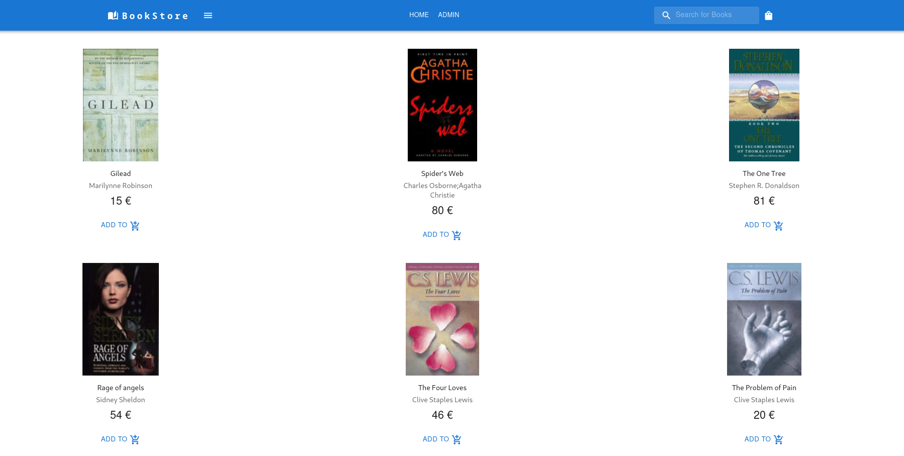
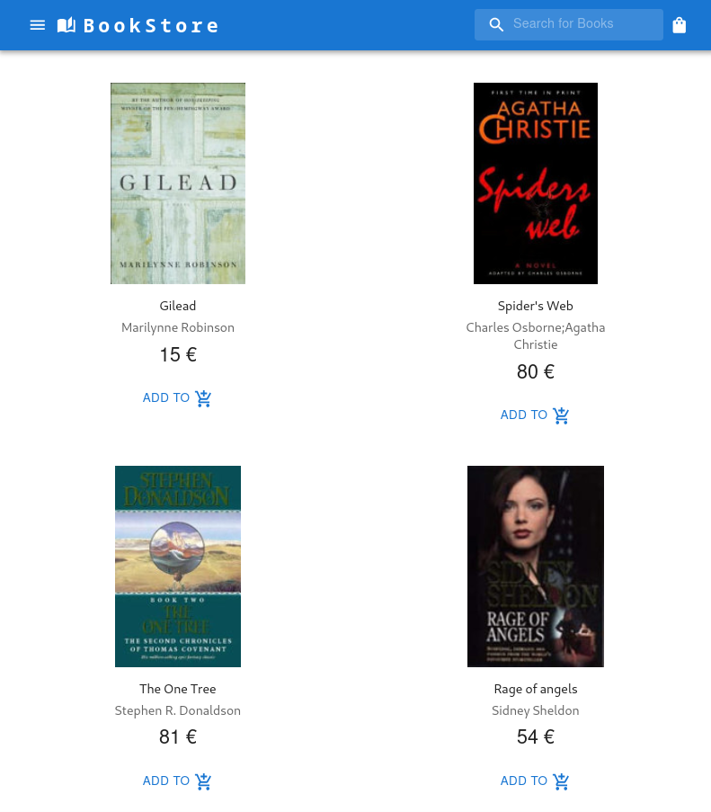
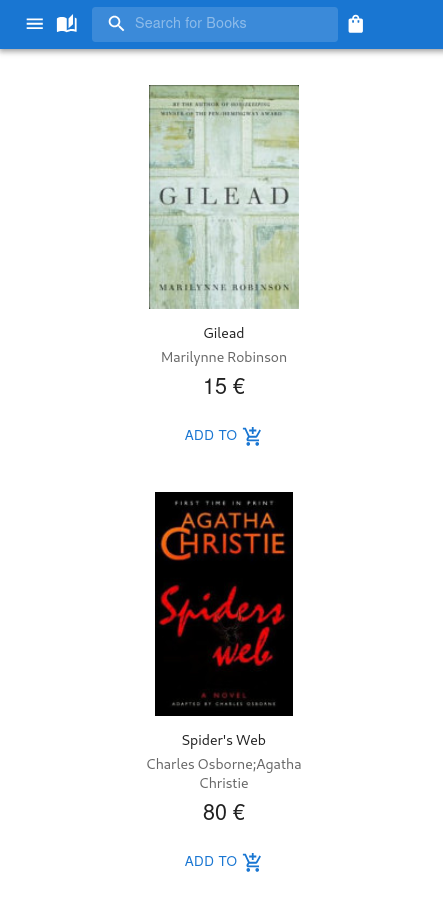

# BookStore

A simple bookstore application written in React with MUI and react-router.
 
This repository contains the backend of the app.
For the backend click [here](https://github.com/DimMil24/BookStoreServer-C-Sharp).
 

## Features

- Responsive Design
- Search with filters
- Group By Category
- Admin Book Management

## Admin Page

Books can be added, edited and deleted.

## Responsive Design

### Large ViewPort

### Medium ViewPort

### Small ViewPort

